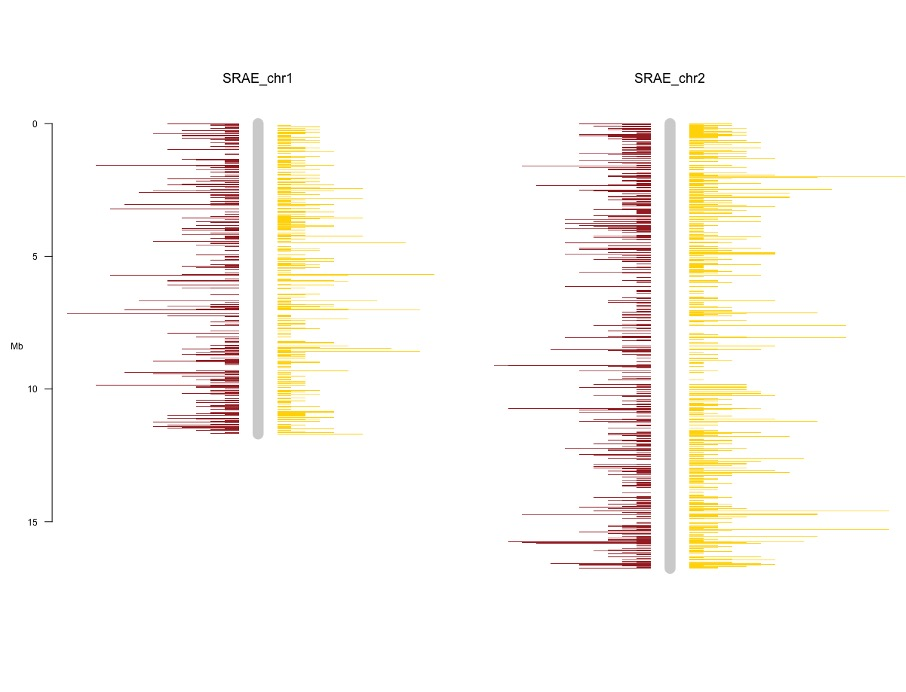

# Other Tasks

This page covers some other bioinformatics tasks you may want to combine with the pipeline, using both programs included with and separate from the pipeline.

## Plotting Genome Location

### Basic Plot

A common task you might want to do is plotting the location of things within the genome, for example, genome features you are interested in or the positions of small RNAs you have aligned to the genome. To make this easy, a script is included in this environment called `build_coord_files`. This automatically generates tsv files for use with the R package `chromPlot`. This section explains how you can generate a plot with it.

Firstly, you need at least two files: a full genome in a FASTA or FASTQ file and a set of locations you are interested in, either as an alignment output (in SAM or BAM format) or as feature annotations in GFF format. To start produce the genome coordinate file with the command: (assuming `genome.fasta` is your genome file)

```
$ build_coord_files -o genome_coord.tsv genome.fasta 
```

By default, the script will figure out what type of output to produce by the file extension. But if it can’t, the user will need to provide a flag to tell it what type of input you are using (in this case `--fasta`). Next we produce the coordinates file for the item of interest, assuming it is in `alignment.sam` you can run:

```
$ build_coord_files -o alignment_coord.tsv alignment.sam
```

This will produce two files, one for coordinates on the sense strand and one for coordinates on the antisense strand. Finally, we can use these files to plot the result. If it isn’t already, install chromPlot with bioconducter using the following R command:

```r
> BiocManager::install("chromPlot")
```

Then you should be able to create a plot using the following R code (of two example chromosomes called "SRAE_chr1" and "SRAE_chr2"):

```r
chrom_coords <- read.csv("/path/to/genome_coord.tsv", sep = "\t")
sense_pos <- read.csv("/path/to/sense_alignment_coord.tsv", sep = "\t")
antisense_pos <- read.csv("/path/to/antisense_alignment_coord.tsv", sep = "\t")

library(chromPlot)

chromPlot(
  gaps = chrom_coords, annot1 = sense_pos, annot2 = antisense_pos, plotRndchr = T,
  chr = c("SRAE_chr1", "SRAE_chr2"), bin = 50000, 
  chrSide = c(-1, 1, -1, -1, 1, -1, -1, 1)
)
```

The script breaks down as follows:

-	First three lines load in the data we just produced with `build_coord_files`
-	Following line loads the chromPlot library into R
-	The final line plots the data with chromPlot:
-	`gaps` defines what each chromosome should look like
-	`annot1` and `annot2` define the annotation data to show
-	`plotRndchr` disables the assumption in chromPlot that the chromosomes are labelled with numbers
-	`chr` selects which chromosomes to plot by specifying an array of names
-	`bin` sets the bin size to group the features into when plotting
-	`chrSide` defines which side of the chromosome to plot each feature, the only change we have made from the default is setting the second item to `1` as opposed to `-1`. This ensures `annot2` is plotted on the opposite side to `annot1`

The resulting plot will look something like this:


 
### Dealing with Multiple Scaffolds

In more complex cases, one or more of your chromosomes may be split into multiple scaffolds. `build_coord_files` has a scaffold aware mode that can automatically try to merge these, but it will only work if your scaffold’s IDs are in the form of `<chromosome_name>_scaffold<scaffold_number>` e.g. `SRAE_chrX_scaffold1`. Once you have this, you can generate the data files with the `-c` flag set, as follows:

```
$ build_coord_files -c -o genome_coord.tsv genome.fasta 
$ build_coord_files -c --genome-coords genome_coord.tsv -o alignment_coord.tsv alignment.sam
```

Note you need to provide the genome coords file when generating files for what you are plotting, this allows for a correction of coordinates to be made from where scaffolds are merged. In addition to the regular files, this produces `scaffold_info_genome_coord.tsv`, that can be used to add scaffold dividers to your plots. To do this, the following R script can be run:

```r
chrom_coords <- read.csv("/path/to/genome_coord.tsv", sep = "\t")
sense_pos <- read.csv("/path/to/sense_alignment_coord.tsv", sep = "\t")
antisense_pos <- read.csv("/path/to/antisense_alignment_coord.tsv", sep = "\t")
scaffolds <- read.csv("/path/to/scaffold_info_genome_coord.tsv", sep = "\t")

library(chromPlot)

chromPlot(
  gaps = chrom_coords, annot1 = sense_pos, annot2 = antisense_pos, plotRndchr = T,
  chr = c("SRAE_chr1", "SRAE_chr2"), bin = 50000, bands = scaffolds,
  chrSide = c(-1, 1, -1, -1, 1, -1, -1, 1)
)
```

Compared to the last script, this adds:

-	The fourth line, that loads in the scaffold data
-	The bands argument, that draws red lines at the end of each scaffold

Note that, by default the bands are 20,000 bp wide, as that looks good on the plot. At that size they may not appear if you make the bins too much bigger. Therefore, if you plan to make the bins bigger, pass a larger value to the `--band-width` flag when creating the genome file. That makes the bands bigger, which results in a more visible line on the plot.

A plot produced by this method will look something like:
 

 
## Signature Identification

TODO

## AT/GC Richness 

Nucleotide richness and the presence of any conserved motifs is identified using [WebLogo](https://weblogo.threeplusone.com). Sequences need to be the same length and can be either uploaded using a fasta file or can be pasted in.

## Upstream motif (e.g. piRNA)

1. Map to genome with bowtie2, convert sam to bam with `samtools`, convert bamToBed with `bedtools` 

```
$ bowtie2 -x genome.fasta -f -U sequences.fasta -S sequences_mapped.sam
$ samtools view sequences_mapped.sam -o sequences_mapped.bam
$ bamToBed -i sequences.bam > sequences.bed
```

2. Extract flanking sequences with flankBed in `bedtools` (need to use bedtools format genome file - generate with faidx and cut):

```
$ samtools faidx genome.fasta  
$ cut -f 1,2 genome.fa.fai > chrom.sizes
$ flankBed -i sequences.bed -g chrom.sizes -b 100 > sequences_100nt_flank.bed
```

or for 60 upstream only:

```
$ flankBed -i sequences.bed -g chrom.sizes -l 60 -r 0 > sequnences_60nt.bed
```

3. Extract fasta sequences from bed fastFromBed with bedtools.

```
$ fastaFromBed -fi genome.fasta -bed sequences_100nt_Flank.bed -fo sequences_100nt_Flank_seqs.fasta
```

## Ping Pong signature

To find ping-pong signature, Unitas with the option -pp can be used to find 5’ overlaps of mapped sequence reads to the genome and calculate a Z-score for the enrichment of 10 bp overlaps. `map.file` should be in SAM or ELAND3 format.

```
$ perl unitas.pl -pp -input map.file  –species x –refseq reference.fasta
```

## Dicer Signature (StepRNA)

To install stepRNA, see the documentation on [the GitHub page](https://github.com/Vicky-Hunt-Lab/stepRNA).

stepRNA is able to identify a Dicer processing signature from a small RNA sequence dataset. It requires two FASTA files as input that have had their adapters already trimmed from the ends.

```
$ stepRNA --reference REFERENCE.fa --reads READS.fa
```

- READS.fa should contain all of the small RNA sequencing reads.
- REFERENCE.fa is usually filtered to investigate small RNAs of interest e.g. 26G sRNAs.

Identical reads in the READ and REFERENCE files can also be removed before searching for a Dicer signature, if desired, by using `-e/--remove_exact`. 

Importantly the FASTA headers must be unique - this can be done by stepRNA with `-u/--make_unique`.

stepRNA will then generate: 

- BAM alignment files (with different combinations of overhang lengths)
- Overhang length CSV
- Passenger Read Length CSV

These can then be used to plot the distribution and/or further explore the reads that have aligned. 

Note: If the sRNA lengths in the read file are all the same i.e. 21 nt long, stepRNA will not be able to find overhangs due to the scoring system. In this case the `-m/--min_score` should be set to an appropriate value; we recommend sRNA length - 7nt (e.g. 21 - 6 = 15).

Use `stepRNA --help` to bring up the command line help, a description of the methods can be found in the [stepRNA publication](https://www.frontiersin.org/journals/bioinformatics/articles/10.3389/fbinf.2022.994871/full).

```
stepRNA [-h] -r REFERENCE -q READS [-n NAME] [-d DIRECTORY]
               [-m MIN_SCORE] [-e] [-u] [-j] [-V]

Align a reference RNA file to read sequences. Output will be a set of CSV files containing information about the length of the reads, number of reads aligned to a reference sequence and the length of overhangs of the alignment.
Reference RNA file will be automatically indexed

Optional Arguments:
  -h, --help            show this help message and exit
  -n NAME, --name NAME  Prefix for the output files
  -d DIRECTORY, --directory DIRECTORY
                        Directory to store the output files
  -m MIN_SCORE, --min_score MIN_SCORE
                        Minimum score to accept, default is the shortest read
                        length

Required Arguments:
  -r REFERENCE, --reference REFERENCE
                        Path to the reference sequences
  -q READS, --reads READS
                        Path to the read sequences

Flags:
  -e, --remove_exact    Remove exact read matches to the reference sequence
  -u, --make_unique     Make FASTA headers unique in reference and reads i.e.
                        >Read_1 >Read_2
  -j, --write_json      Write count dictionaries to a JSON file
  -V, --version         Print version number then exit.
```

## miRNA

TODO